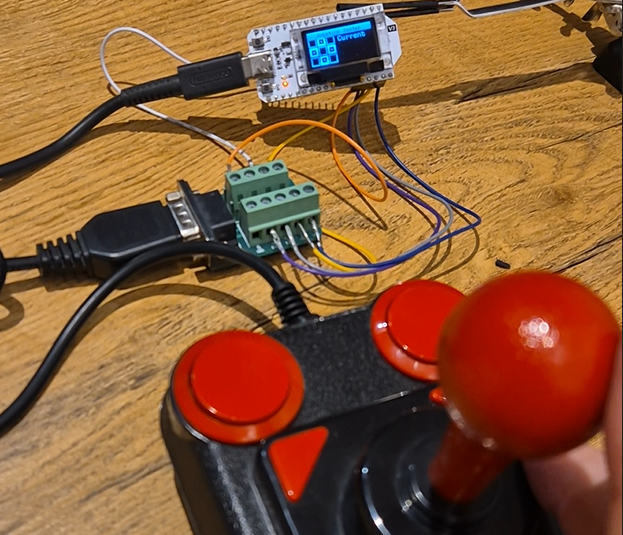

# Amiga Joystick Tester




An **Amiga Joystick Tester** built using an **ESP32-based Heltec WiFi Kit 32 (V3)** board and an **OLED display**. This project allows you to test all the functionalities of an Amiga joystick, including directional inputs and fire buttons, and displays the results on the built-in OLED screen.

## Table of Contents

- [Purpose](#purpose)
- [Amiga Joystick Port](#amiga-joystick-port)
- [Hardware Requirements](#hardware-requirements)
- [Arduino Setup and Installation](#arduino-setup-and-installation)
  - [Install ESP32 Board Support](#install-esp32-board-support)
  - [Install Required Libraries](#install-required-libraries)
  - [Select the Heltec WiFi Kit 32 (V3) Board](#select-the-heltec-wifi-kit-32-v3-board)
- [Wiring Connections](#wiring-connections)
- [Code Structure](#code-structure)
  - [Joystick Class](#joystick-class)
  - [DisplayManager Class](#displaymanager-class)
- [Usage](#usage)
- [License](#license)
- [Additional Information](#additional-information)

---

## Purpose

The purpose of this project is to provide a simple and effective way to test Amiga joysticks using modern hardware. By connecting the joystick to the ESP32 board, you can visualize the joystick's inputs on the OLED display, including:

- Directional inputs (Up, Down, Left, Right, and Diagonals)
- Fire buttons (support for joysticks with one or two fire buttons)
- Visual representation of active, inactive, and previously detected inputs

This tool is particularly useful for enthusiasts and collectors who want to verify the functionality of vintage Amiga joysticks.


---

## Amiga Joystick Port

The Amiga joystick uses a DE-9 connector, commonly known as the Atari joystick port. The standard pinout for the joystick port is as follows:

| Pin | Function          |
|-----|-------------------|
| 1   | Up                |
| 2   | Down              |
| 3   | Left              |
| 4   | Right             |
| 5   | Ground            |
| 6   | +5V (VCC)         |
| 7   | Fire Button 1     |
| 8   | Pot X (Optional)  |
| 9   | Pot Y (Optional)  |

**Notes:**

- **Pins 1-4 and 7**: These are digital inputs, active low (connected to ground when activated).
- **Pins 8 and 9**: Originally intended for analog inputs but can be repurposed for additional buttons on some joysticks.

This project utilizes these pins to read the joystick inputs and display them on the OLED screen.

---

## Hardware Requirements

- **Heltec WiFi Kit 32 (V3)**: An ESP32-based development board with a built-in 0.96" OLED display.
- **Amiga Joystick**: Any joystick compatible with the Amiga DE-9 joystick port.
- **Breadboard and Jumper Wires**: For making connections between the joystick and the ESP32 board.
- **DE-9 Connector**: To connect the joystick to the breadboard or directly to the ESP32.

---

## Arduino Setup and Installation

### Install ESP32 Board Support

1. **Install Arduino IDE**: Ensure you have the latest version of the Arduino IDE installed.

2. **Add ESP32 Board Manager URL**:

   - Open **Arduino IDE**.
   - Go to **File** > **Preferences**.
   - In the **Additional Board Manager URLs** field, add the following URL:
     ```
     https://raw.githubusercontent.com/espressif/arduino-esp32/gh-pages/package_esp32_index.json
     ```
   - Click **OK**.

3. **Install ESP32 Boards**:

   - Go to **Tools** > **Board** > **Boards Manager**.
   - Search for **ESP32**.
   - Install **"esp32 by Espressif Systems"**.

### Install Required Libraries

#### u8g2 Library

The `u8g2` library is used to control the OLED display.

1. **Install via Library Manager**:

   - Go to **Tools** > **Manage Libraries**.
   - Search for **u8g2**.
   - Install **"U8g2 by olikraus"**.

### Select the Heltec WiFi Kit 32 (V3) Board

1. **Select Board**:

   - Go to **Tools** > **Board** > **ESP32 Arduino**.
   - Select **"Heltec WiFi Kit 32(V3)"**.

2. **Configure Port and Upload Speed**:

   - Ensure the correct **Port** is selected under **Tools** > **Port**.
   - Set the **Upload Speed** to **921600** (or a speed supported by your setup).

---

## Wiring Connections

Connect the joystick to the ESP32 board as follows:

| Joystick Pin | Function        | ESP32 GPIO Pin |
|--------------|-----------------|----------------|
| Pin 1        | Up              | GPIO **2**     |
| Pin 2        | Down            | GPIO **3**     |
| Pin 3        | Left            | GPIO **4**     |
| Pin 4        | Right           | GPIO **5**     |
| Pin 5        | Ground          | GND            |
| Pin 7        | Fire Button 1   | GPIO **6**     |
| Pin 8 or 9   | Fire Button 2\* | GPIO **(optional)** |

\* **Note**: If your joystick has a second fire button, it may be connected to Pin 8 or Pin 9. Ensure you verify the correct pin for your joystick and assign an appropriate GPIO pin on the ESP32.

**Important Wiring Notes:**

- **GPIO Pins**: The ESP32 GPIO pins are **not 5V tolerant**. Ensure all connected voltages are within 0V to 3.3V.
- **Pull-up Resistors**: The joystick buttons are active low. Enable internal pull-up resistors on the ESP32 GPIO pins.
- **Ground Connection**: Make sure the ground of the joystick (Pin 5) is connected to the GND of the ESP32.
- **GPIO 2 and 3 Considerations**: Be cautious when using GPIO 2 and 3, as they have specific functions during boot. Ensure they are suitable for your application.

---

## Code Structure

The project is organized into the following main components:

### Main Sketch (`AmigaJoystickTester.ino`)

The main Arduino sketch initializes the joystick and display, and contains the `setup()` and `loop()` functions.

### Joystick Class

Handles reading the joystick inputs and maintains the current and detected states.

#### Features:

- **Input Reading**: Reads the state of each joystick input pin.
- **State Management**: Maintains current and detected states using bit masks.
- **Diagonal Detection**: Recognizes diagonal inputs and sets appropriate masks.
- **Fire Buttons**: Supports one or two fire buttons, depending on the joystick.

### DisplayManager Class

Handles displaying the joystick states on the OLED screen.

#### Features:

- **Splash Screen**: Displays an introductory screen on startup.
- **Input Visualization**: Shows a grid of boxes representing joystick inputs.
  - **Active Inputs**: Boxes corresponding to currently active inputs are filled.
  - **Previously Detected Inputs**: Boxes for inputs that have been activated at least once but are not currently active have a thicker border.
  - **Inactive Inputs**: Boxes for inputs that have never been activated are shown with a normal frame.
- **Current Values Display**: Lists the current active inputs in text form.

---

## Usage

1. **Assemble the Hardware**:

   - Connect the joystick to the ESP32 board as per the wiring instructions.
   - Ensure all connections are secure and voltage levels are appropriate.

2. **Upload the Code**:

   - Open the `AmigaJoystickTester.ino` sketch in the Arduino IDE.
   - Compile and upload the code to the ESP32 board.

3. **Test the Joystick**:

   - Upon startup, the OLED display will show a splash screen.
   - Move the joystick in all directions and press the fire button(s).
   - The display will show the active inputs and maintain a record of all detected inputs.
   - Use the reset button (if implemented) to clear the detected states.

4. **Visual Indicators**:

   - **Active Inputs**: Boxes corresponding to currently active inputs are filled.
   - **Previously Detected Inputs**: Boxes for inputs that have been activated at least once but are not currently active have a thicker border.
   - **Inactive Inputs**: Boxes for inputs that have never been activated are shown with a normal frame.

---

## License

This project is open-source and available under the [MIT License](LICENSE).

---

**Note**: For any issues or contributions, please feel free to open an issue or pull request on the [GitHub repository](https://github.com/yourusername/AmigaJoystickTester).

---

*Images and diagrams will be added to illustrate the wiring and display output.*

---

## Additional Information

### Pin Considerations

- **GPIO 2**: On the ESP32, GPIO 2 is connected to the built-in LED and is used for boot modes. It has an internal pull-down resistor. Using GPIO 2 as an input pin can cause issues during boot if the connected device pulls it high. Ensure that connecting the joystick's Up direction to GPIO 2 does not interfere with the boot process. If you experience boot issues, consider using a different GPIO pin.

- **GPIO 3**: GPIO 3 is typically used as the UART RX pin. Using it as a regular GPIO pin may interfere with serial communication, especially if you use the serial port for debugging or programming. It is generally not recommended to use GPIO 3 as a regular input pin unless you are not using serial communication.

- **Alternative Pins**: If you encounter issues with GPIO 2 and 3, consider using other GPIO pins that do not have special functions during boot or normal operation. For example, GPIO 16, 17, 18, 19, 21, 22, and 23 are generally safe to use.

### Recommended Pin Assignments

Given the potential issues with GPIO 2 and 3, it is recommended to use alternative GPIO pins:

| Joystick Pin | Function        | ESP32 GPIO Pin |
|--------------|-----------------|----------------|
| Pin 1        | Up              | GPIO **16**    |
| Pin 2        | Down            | GPIO **17**    |
| Pin 3        | Left            | GPIO **18**    |
| Pin 4        | Right           | GPIO **19**    |
| Pin 5        | Ground          | GND            |
| Pin 7        | Fire Button 1   | GPIO **22**    |
| Pin 8 or 9   | Fire Button 2\* | GPIO **23**    |

Adjust your wiring and code accordingly if you choose to use these alternative pins.

### Class Structure Overview

#### Joystick Class

- **Purpose**: Manages reading input from the joystick and processing the current and detected states.
- **Key Functions**:
  - `begin()`: Initializes the GPIO pins for input with pull-up resistors.
  - `update()`: Reads the state of each input and updates the current and detected states.
  - `reset()`: Clears the detected states.
  - `getCurrentState()`: Returns the current state of the joystick.
  - `getDetectedStates()`: Returns the cumulative detected states.

#### DisplayManager Class

- **Purpose**: Handles all interactions with the OLED display, including drawing the splash screen and updating the display based on joystick input.
- **Key Functions**:
  - `begin()`: Initializes the OLED display.
  - `showSplashScreen()`: Displays the splash screen on startup.
  - `updateDisplay(currentState, detectedStates)`: Updates the display to reflect the current and detected joystick inputs.

---

**Please ensure that you adjust the code to reflect any changes in pin assignments or hardware configurations.**

If you have any questions or need further assistance, feel free to reach out!